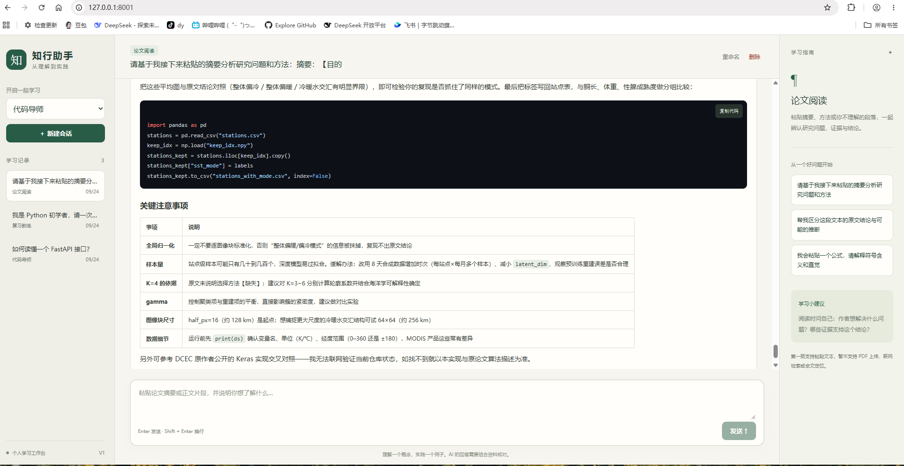

# CodePaper

一个用于边做边学的个人工作台：代码导师、论文文本阅读、复习教练。
技术栈为 Python 3.12+、FastAPI、原生 HTML/CSS/JavaScript、OpenAI 兼容模型接口及 JSON 文件存储。

## 启动

在本项目目录执行：

```powershell
python -m pip install -r requirements.txt
python main.py
```

访问 http://127.0.0.1:8001 。即使没有密钥，首页、会话管理和历史浏览也能使用。
项目以文件位置寻找静态资源和会话目录，从其他工作目录调用入口同样可用。

将 `.env.example` 复制为本目录的 `.env`，填写密钥并重启服务：

```dotenv
DEEPSEEK_API_KEY=你的密钥
LLM_BASE_URL=https://api.deepseek.com
LLM_MODEL=deepseek-v4-pro
LLM_TIMEOUT=90
```

模型名沿用旧项目，请按服务商实际可用模型配置；代码不会自动切换模型。
`LLM_API_KEY` 如果非空，优先于 `DEEPSEEK_API_KEY`。操作系统环境变量优先于 `.env`。
先找本目录 `.env`，没有才向父目录查找最近的 `.env`，不会同时合并多个文件。
`.env.example` 不是实际配置。不要把真实 `.env` 或个人会话提交到版本库。

## 使用



1. 左侧选择模式并新建会话，或者直接在首页发送，默认使用代码导师。
2. 代码模式可粘贴代码、报错或知识问题；请求“先给提示”可练习自己推导。
3. 论文模式粘贴摘要或正文，回答应区分原文依据、推断与背景；本版没有 PDF 上传或联网检索。
4. 复习模式提供主题或笔记，一次一道题，等你回答后反馈。不读取其他会话。
5. Enter 发送，Shift+Enter 换行。代码块有复制按钮，会话可重命名与删除。

会话模式在创建后固定。切换任务请新建会话；首条成功消息自动生成短标题，手动名称不会被覆盖。
旧字谜记录显示为只读，原文件保留，可查看或删除。删除操作经页面确认后移除本地文件，应用内不可撤销。
刷新后从左侧记录重新打开会话；未发送草稿及失败片段只保留在当前页面内存中，不会跨刷新保存。

## 模块导航

| 模块 | 职责 |
| --- | --- |
| `main.py` | 创建应用并启动 8001 端口 |
| `study_assistant/application.py` | 组装路由、静态文件与异常处理 |
| `study_assistant/config.py` | 环境配置与绝对路径 |
| `study_assistant/schemas.py` | 输入校验及普通响应结构 |
| `study_assistant/prompts.py` | 三种教学模式的系统提示词 |
| `study_assistant/storage.py` | JSON 读写、旧格式兼容、原子保存与锁 |
| `study_assistant/llm.py` | 异步模型调用、仅提取正文、判断回答是否完整 |
| `study_assistant/routes.py` | 把请求、模型与存储串联起来 |
| `static/app.js` | 页面状态、会话操作及安全 Markdown 展示 |
| `static/stream.js` | 网络文本块转为完整 SSE 事件 |

## 接口约定

普通接口返回 `{code, message, data}`，HTTP 状态与错误码保持一致。交互式文档位于 `/docs`。

| 接口 | 请求与返回 |
| --- | --- |
| `GET /api/sessions` | `data` 为会话摘要数组，无法读取的文件在 `message` 提示 |
| `POST /api/sessions` | `{mode: "code"\|"paper"\|"review", name?: string}`，返回摘要；省略 body 时默认 code |
| `GET /api/sessions/{id}` | 返回元数据和 `messages` |
| `PATCH /api/sessions/{id}` | `{name: string}`，返回更新后的摘要 |
| `DELETE /api/sessions/{id}` | 删除对应会话文件 |
| `POST /api/sessions/{id}/messages` | `{message: string}`，返回完整回答文本 |
| `POST /api/sessions/{id}/messages/stream` | 同上，通过 SSE 返回正文增量与完成状态 |

摘要字段为 `id/name/mode/created_at/updated_at/read_only`。旧记录 `mode=legacy`。
消息请求兼容旧 `session_id` 字段，但必须与 URL 一致。旧版前端的“ID 字符串数组”列表协议已更新为摘要数组。
会话名称 1–60 字符，单条消息 1–24000 字符；总模型输入上限 60000 字符，超过时提示新建会话，不静默裁剪。
字符数不是 token 数，模型自身限制可能更低；生成被截断时会明确报错。

SSE 帧之间用空行分隔，`data` 为 JSON：

```text
event: delta
data: {"content":"正文片段"}

event: done
data: {"session":{"id":"...","name":"...","mode":"code","created_at":"...","updated_at":"...","read_only":false}}

```

失败使用 `event: error` 和 `{"message":"错误说明"}`，不发送 `done`。响应头发送前发现的错误仍使用普通 JSON 错误响应。
只有完整正文成功返回才保存一轮 user/assistant 消息。连接中断或失败不会保存半截回答；前端保留草稿并查询历史，以处理“已保存但完成通知丢失”。
浏览器关闭后，未保存草稿不保留。若恰好在服务器提交后断开，完整对话仍可能已经保存，应以刷新后的历史为准。

## 检查与测试

```powershell
python -m pytest tests/test_backend.py -q
node --test tests/frontend.test.cjs
```

测试使用临时会话目录和模拟模型，不调用真实模型、不改动 `sessions/`。
浏览器测试默认使用本机 Microsoft Edge 的无头模式，测试服务使用 8017 端口：

```powershell
npm.cmd ci --ignore-scripts
npm.cmd run test:browser
```

若本机没有 Edge，在 Playwright 配置中选择已安装的浏览器；也可安装 Playwright Chromium 后去掉 `channel`。
截图写入 `test-results/`。真实模型测试单独运行，会调用配置的服务并可能产生少量费用，不保存会话：

```powershell
python -m scripts.check_model
```

模拟测试通过不代表远程服务、密钥或模型已通过真实联调。

### 本次验收记录（2026-09-23）

- 后端：13 项通过，包含历史兼容、原子写入失败、并发拒绝、断开连接取消、正文过滤和上下文限制。
- 流式解析：3 项通过，包含逐字节中文传输、跨块事件拼接及不完整数据拒绝。
- 浏览器：5 项通过，使用 Microsoft Edge 无头模式检查桌面与 390px 窄屏、复制代码、注入清洗、失败重试、会话切换和旧快照竞态；已查看桌面和窄屏截图确认布局。
- 真实模型：使用现有环境配置完成一次短文本流式请求，收到 5 个正文字符，未写入真实会话。此项只验证连接与流式协议，不代表教学或论文回答的事实准确性已通过评估。
- 源码编译与差异空白检查通过。测试未修改原有两份字谜会话。

## 本地前端依赖

页面加载 `static/vendor/` 下的 Marked、DOMPurify、Highlight.js，不依赖运行时 CDN，也不需要前端开发服务器。
第三方版本锁定在 `package-lock.json`，许可证随本地资源一起保留。维护时重新生成：

```powershell
npm.cmd ci --ignore-scripts
npm.cmd run vendor
```

使用 `npm.cmd` 是为了避免 Windows PowerShell 对 `npm.ps1` 的执行策略限制。

## 第一版限制与学习路线

这是绑定 `127.0.0.1` 的本机单用户服务，不包含账号认证。会话锁只在单个进程生效，请保持一个 worker，不并行启动多个实例访问同一会话目录。
本版没有 PDF 解析、数据库、代码执行、跨会话记忆和自动复习计划。它通过三种提示词组织教学，不具有自主工具调用能力。

按顺序阅读 [阶段一：后端请求链路](docs/01-backend.md)、[阶段二：模式与会话](docs/02-modes.md)、[阶段三：流式交互](docs/03-streaming.md)。每篇包含关键代码入口、验证步骤与可选练习。
